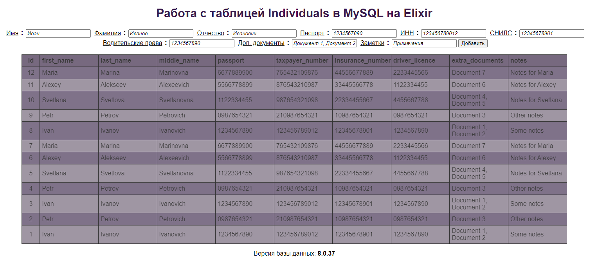

# practElixir
Как можно работать с таблицами в MySQL на Elixir

Учебный пример не требует Apache. Достаточно запустить файл run_server.bat из каталога с исходниками. Чтобы работала база данных, необходимо экспортировать структуру и таблицы из файла import_test.sql . После запуска сервера, перейти на страницу: http://localhost:4000/

Примерный вид таблицы:

Пример гарантированно работает:
1) Операционная система: Windows 11 Home, Version: 22H2, Build: 22621.1485;
2) Версия Erlang/OTP 25 [erts-13.2] [source] [64-bit] [smp:2:2] [ds:2:2:10] [async-threads:1] [jit:ns];
3) Версия Elixir 1.14.4 (compiled with Erlang/OTP25);
4) Модули для работы с HTTP и MySQL [:myxql, :plug, :plug_cowboy] установятся при первом запуске из скрипта.
